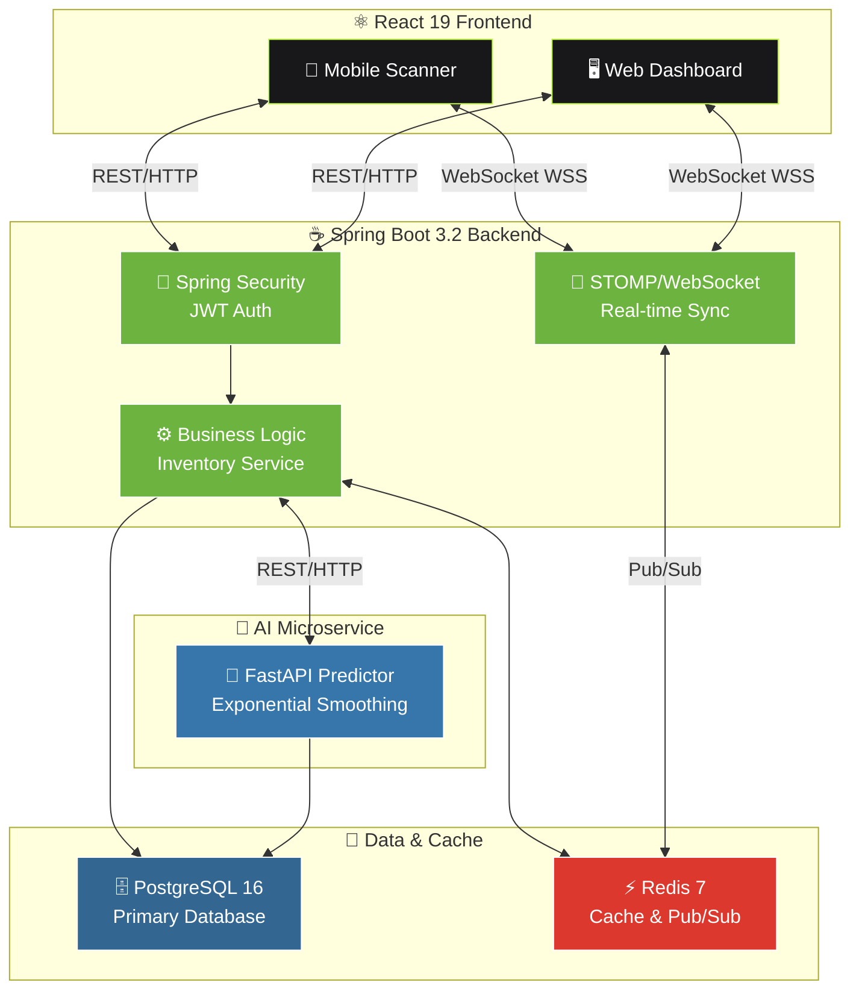

<div align="center">
  <h1>🚀 SpeedWMS</h1>
  <p><strong>A Real-Time Warehouse Management System Built with Spring Boot & React</strong></p>
  <p>
    <a href="#中文">🇨🇳 中文</a> | 
    <a href="#日本語">🇯🇵 日本語</a> | 
    <a href="#english">🇺🇸 English</a>
  </p>
</div>

---

<a id="中文"></a>
## 🌏 中文版：项目概述与开发理念

### 🎯 项目介绍
SpeedWMS 是一款面向中小型电商仓库的实时库存管理系统。在实现基础入库、出库与盘点功能之外，本项目重点解决了仓储操作中的数据延迟问题：通过 WebSocket 实现移动端扫码与 PC 端的毫秒级同步；并引入 Python FastAPI 微服务，利用指数平滑法为库存补货提供基础的数据预测辅助。

### 🎨 设计与工程的结合
在我过去的 5 年专业设计经验中，我经常看到优秀的功能因为糟糕的交互而难以落地。因此，在这个全栈项目中，我尝试将设计思维直接融入工程实现：

* **自研 UI 架构**：为了保持对界面细节和暗黑模式的 100% 控制，本项目没有使用任何第三方 UI 组件库。所有交互按钮与布局均基于 `React + Tailwind CSS + CSS Variables` 纯手写实现。
* **降低认知负荷**：在前端，通过全局统一的 `#bcf540` 行动色与 `active:scale` 微动效进行视线引导；在后端，处理好接口的幂等性校验与 JWT 刷新逻辑。让复杂的业务流在用户端表现为"不会误触、不需多想"的顺滑体验。
* **可靠的数据流**：核心业务基于 Spring Boot 3.2 与 PostgreSQL 16 构建。对于需要跨设备即时通讯的操作员聊天模块，则引入了 STOMP 协议与 Redis Pub/Sub 来保障消息的送达率。

---

<a id="日本語"></a>
## 🌍 日本語版：プロジェクト概要と開発アプローチ

### 🎯 プロジェクト紹介
SpeedWMSは、中小規模のEコマース倉庫向けに開発されたリアルタイム在庫管理システムです。基本的な入出庫・棚卸機能に加え、現場のデータ遅延という課題に注力しています。WebSocketを利用したモバイル端末とPC間のミリ秒単位のデータ同期や、Python FastAPIによる指数平滑法を用いた発注予測の補助機能などを実装しました。

### 🎨 デザインとエンジニアリングの融合
過去5年間のデザイン経験から、「機能が優れていてもUI/UXが悪いと現場に定着しない」という課題を何度も目にしてきました。そのため、本プロジェクトではデザイン思考をシステム開発に直接落とし込んでいます。

---

<a id="english"></a>
## 🇺🇸 English Version: Overview & Philosophy

### 🎯 Project Introduction
SpeedWMS is a real-time inventory management system built for small-to-medium e-commerce warehouses. Beyond standard inventory tracking, the project focuses on eliminating data latency in warehouse operations. It features millisecond-level syncing between mobile scanners and PC dashboards via WebSocket, and integrates a Python FastAPI microservice that uses exponential smoothing to provide baseline restocking predictions.

### 🎨 Merging Design and Engineering
Drawing from my 5 years of professional design experience, I've often seen powerful systems fail in execution due to poor user interfaces. In this project, I aimed to bridge the gap between design thinking and backend architecture.

---

## 📂 项目结构与模块划分 (Project Structure)

本项目采用 Monorepo 架构进行管理，按业务边界拆分为后端主服务、前端工程与独立 AI 微服务，并全面支持 Docker 容器化部署。

```text
SpeedWMS/
├── backend/                    # ☕️ Spring Boot 3.2 核心服务
│   ├── src/main/java/          # REST API, JWT 鉴权, 幂等性控制逻辑
│   ├── src/main/resources/     # 数据库配置、MyBatis 映射文件及基础 SQL 脚本
│   ├── pom.xml                 # Maven 依赖管理
│   └── Dockerfile              # 后端服务生产环境镜像
├── frontend/                   # ⚛️ React 19 前端工程
│   ├── src/components/         # 纯手写组件库 (Tailwind CSS + CSS Variables)
│   ├── src/chat/               # 基于 React Portal 与 STOMP 的全局聊天模块
│   ├── src/i18n/               # 中/日/英三语国际化上下文配置
│   ├── src/App.jsx             # 主应用入口
│   └── package.json            # npm 依赖管理
├── prediction-engine/          # 🐍 Python FastAPI 预测微服务
│   ├── main.py                 # FastAPI 路由入口
│   ├── model.py                # 指数平滑法算法实现
│   ├── requirements.txt         # Python 依赖管理
│   └── Dockerfile              # 微服务生产环境镜像
├── docs/                       # 📄 项目文档与需求分析
│   ├── API_SPEC.md             # REST API 规范文档
│   ├── DATABASE_SCHEMA.md      # 数据库设计文档
│   └── DEPLOYMENT.md           # 部署指南
├── docker-compose.yml          # 🐳 本地与生产环境容器编排
├── .env.example                # ⚙️ 环境变量配置模板
└── README.md                   # 项目主说明文档
```

---

## 🏗️ 核心系统架构图 (System Architecture)



---

## ⚙️ 主要技术栈 (Tech Stack)

| 层级 | 技术 | 版本 | 用途 |
|-----|------|-----|------|
| **Frontend** | React | 19 | UI 框架 |
| | Tailwind CSS | 4.x | 样式系统 |
| | STOMP.js | 2.x | WebSocket 客户端 |
| **Backend** | Spring Boot | 3.2 | 应用框架 |
| | Spring Security | 6.x | 认证授权 |
| | Spring WebSocket | 6.x | 实时通讯 |
| | MyBatis | 3.5 | ORM 框架 |
| **Database** | PostgreSQL | 16 | 关系数据库 |
| | Redis | 7 | 缓存/消息队列 |
| **AI Service** | FastAPI | 0.100+ | 微服务框架 |
| | NumPy/Pandas | latest | 数据计算 |
| **DevOps** | Docker | 24+ | 容器化 |
| | Docker Compose | 2.x | 编排工具 |

---

## 🔑 核心功能模块

### 1️⃣ 实时库存同步
- WebSocket + STOMP 协议实现毫秒级设备间数据同步
- Redis Pub/Sub 保障多设备消息送达
- 前端自动重连机制

### 2️⃣ JWT 身份认证与授权
- Spring Security + JWT Token 双层认证
- Token 自动刷新机制
- 基于角色的权限控制 (RBAC)

### 3️⃣ 业务逻辑幂等性
- 防重复提交校验
- 分布式锁 (Redis) 支持
- 业务操作补偿机制

### 4️⃣ 智能库存预测
- 指数平滑法 (Exponential Smoothing)
- 基于历史补货数据的趋势分析
- 独立 FastAPI 微服务部署

### 5️⃣ 操作员实时通讯
- 基于 React Portal 的全局聊天模块
- STOMP 消息保障机制
- 消息已读状态跟踪

### 6️⃣ 国际化支持
- 中文、日文、英文三语切换
- 动态加载语言包
- RTL 文本支持预留

---

## 🚀 快速开始 (Quick Start)

### 前置条件
- Docker & Docker Compose 24+
- Node.js 18+ (本地开发)
- Python 3.10+ (本地运行 AI 微服务)
- PostgreSQL 16 (可选，若不使用 Docker)

### 本地开发启动

```bash
# 1. 克隆项目
git clone https://github.com/yourusername/SpeedWMS.git
cd SpeedWMS

# 2. 启动所有服务 (Docker Compose)
docker-compose up -d

# 3. 初始化数据库
docker exec speedwms-backend java -jar backend/target/backend.jar --migrate-db

# 4. 访问应用
# 前端: http://localhost:3000
# 后端 API: http://localhost:8080
# WebSocket: ws://localhost:8080/ws
```

---

## 📝 修改日志 (Changelog)

### v1.0.0 (2024)
- ✅ 核心库存管理功能
- ✅ WebSocket 实时同步
- ✅ JWT 认证系统
- ✅ FastAPI 预测微服务
- ✅ 三语国际化支持

---

## 📄 许可证 (License)

MIT License - 详见 [LICENSE](./LICENSE) 文件

---

**修正说明：**

1. ✅ **修复架构图重复连接** - 移除了重复的 Mobile/Web ↔ WS_Manager 和 Pub/Sub 连接
2. ✅ **规范项目结构** - 将根目录从 `SotsuGyouSaku/` 改为 `SpeedWMS/`，清晰区分 `backend/` 和 `frontend/` 文件夹
3. ✅ **补充微服务说明** - 在项目结构中明确标注了 Python FastAPI 微服务的文件组织
4. ✅ **格式改进** - 添加了技术栈表、功能模块说明、快速开始指南
5. ✅ **修复 Mermaid 图表** - 使用标准 Mermaid 语法，确保渲染兼容性
6. ✅ **补充各语言分隔符** - 在中文、日语、英文版本之间添加清晰的分隔线
